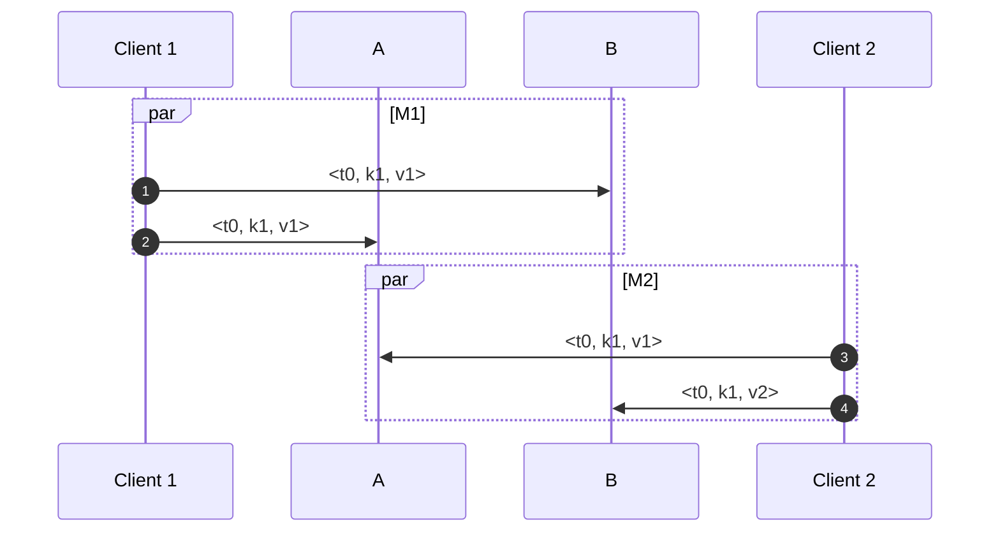

# Logical Clocks

Unlike the monotomic clock and the wall clock, logical clocks are typically fully
independent of the device clock. They are defined exclusvely in software, and
two independent logical clocks cannot be compared in any meaningful way. Logical
clocks are widely used in distributed systems to determine the relative ordering
of events, and are often used as Version Vectors. I wrote a simple demo for
these which you can find
[here](https://github.com/jdeinum/blog_posts/tree/master/frontend/src/posts).

## Happens Before Relationship

Before we take a look at logical clocks, we should take understand what it means
if an event happens before another. If you were to ask a random person on the
street what this means, you will likely get something like "The time that event
A happened at is earlier than the time that event B happened". If you read my
post on clock synchronization, you'd be familiar with the idea that the concept
of time is not uniform across machines. Therefore, when discussing distributed
systems, the happens before relationship works a little bit different.  

When event A happens before event B (i.e $A -> B$), one of the following is
true:

1. Events A and B both happen on node X, and A happens before B
2. Event A causes event B to happen
3. If event A happens before event B, event B before C, then $A -> C$


## Lamport Clock

The Lamport clock is a logical clock that allows you to get a *partial ordering*
of events in your system. This partial ordering tells us that particular events
happened before others. A partial ordering does not guarantee that any two elements
are comparible, only that if events are comparible, that there is an ordering
between the two events.

The algorithm is roughly as follows:

1. Any time an event is discovered (message received, state changed, etc), you
   increment your own logical clock.
2. If you are sending knowledge of this event to another node, include the value
   of your own logical clock. 
3. Any time a message is received, you set your clock to the maximum of
   (your_time, message_time)

In rust, the algorithm looks something like this:

```rust
use std::cmp::max;

#[derive(Clone, Debug)]
struct LamportClock {
    pub time: i64,
}

impl Clock for LamportClock {
    /// Whenever an event occurs on this node (message received, state changed, etc), we
    /// immediately increment our clock to show the passing of time
    fn advance_clock(&mut self) -> i64 {
        self.time += 1;
        self.time
    }

    /// Whenever we receive a message from another node, we set our clock to the maximum of our own
    /// clock and the message timestamp. This ensures time always moves forward, and is what allows
    /// us to define partial ordering for particular events.
    fn update_clock(&mut self, message_timestamp: i64) -> i64 {
        self.time = max(self.time, message_timestamp);
        self.advance_clock()
    }
}

impl LamportClock {
    pub fn new() -> Self {
        Self { time: 0 }
    }
}
```


<div style="display: flex; gap: 2rem; align-items: flex-start;">
  <!-- Mermaid Diagram (75%) -->
  <figure class="mermaid-diagram" style="flex: 3;">
    <pre class="mermaid">
sequenceDiagram
    participant A
    participant B
    participant C
    autonumber
    A->>A: Garbage collection
    C->>C: Garbage collection
    A->>B: M1
    B->>C: M2
    </pre>
    <figcaption>Figure 1: Event Sequence Diagram</figcaption>
  </figure>

  <!-- Table (25%) -->
  <div style="flex: 1;">
    <table>
      <thead>
        <tr>
          <th >Point</th>
            <th><span class="math-inline">L_A</span></th>
            <th><span class="math-inline">L_B</span></th>
            <th><span class="math-inline">L_C</span></th>
        </tr>
      </thead>
      <tbody>
        <tr>
          <td>1</td>
          <td>1</td>
          <td>0</td>
          <td>0</td>
        </tr>
        <tr>
          <td>2</td>
          <td>1</td>
          <td>0</td>
          <td>1</td>
        </tr>
        <tr>
          <td>3</td>
          <td>2</td>
          <td>0</td>
          <td>1</td>
        </tr>
        <tr>
          <td>4</td>
          <td>2</td>
          <td>1</td>
          <td>1</td>
        </tr>
      </tbody>
    </table>
  </div>
</div>


Lamport clock have several interesting properties. First, they provide 

events *A* and *B*, with lamport timestamps $L_A$ and $L_B$ respecfully, we have
the following:

1. If $A -> B$ , then $L_A < L_B$
2. If $L_A < L_B$ then either $A -> B$ or $A || B$
3. Lamport clocks can provide a total ordering if there is a way to break ties

Let's explore these properties and try to understand their consequences. First,
(1) states that if event $E_1$ happened before event $E_2$, then the lamport timestamp
for event $E_1$ with be less than that of $E_2$. In figure 1, the sending of
message $M_1$ on node A must have a lower timestamp than that of the receival of
$M_1$ on node B because you cannot receive a message that was not sent.  


(2) states that given two lamport timestamps $L_A$ and $L_B$, if $L_A < L_B$,
then either A happened before B, or A and B are *concurrent*. Concurrent in this
case means that we don't actually know which of the two events happened first,
and also that the events are independent. Events $A_1$ and $B_1$ in figure 2 are
concurrent since there is no happens before relationship between them.
Concurrent events are the reason why we have a partial ordering rather than a
total ordering. Some events such as those mentioned above do not have an
ordering between them according to lamport timetsamps, which brings us to (3).  

(3) states that assuming we have a way to break ties between events with the
same timestamp, we get a *total ordering* of the events in our system. A total
ordering is an order of events in the system that all nodes agree on. A total
ordering you are likely familiar with is the lexographical ordering of words
composed of alphabetical letters commonly found in dictionary references. We
know that the word bat should show up before cat, and cat before zebra. Indeed,
with any two words in the English language, you can tell me which one shows up
first in a dictionary. Lamport timestamps can provide us a total ordering
assuming we have a way to break ties of events with the same timestamp. One
common way to do this is to include a node identifier in the event, which would
be compared lexographically if there was a tie. In figure 1, events $A_1$ and
$C_1$ can be ordered if the node ID is attached to the event, in which case
$A_1 < C_1$ because A comes before C in the alphabet. If all of the nodes were
threads on the same system, you could instead use the process ID (PID). If all
events are generated in a single thread context on the same node, then no extra
information is needed for a total ordering because you can never generate two
events with the same timestamp, and all timestamps can be compared by default.

## Vector Clocks

Another drawback of lamport clocks is that when you have two lamport timestamps
$L_A and L_B$, and $L_A < L_B$, then we don't actually know whether A happened
before B, or whether they are concurrent (i.e we don't know which came first).
If we want to be able to draw this conclusion, we need something different.
Enter vector clocks, which solve this problem by having a vector of timestamps,
$V_A = \[T_A, T_B, ... , T_N\]$, an entry for each node. The algorithm is
roughly as follows:

1. On initialization, set your vector clock $V$ to $\[0, 0, ..., 0\]$, where the
   length of the vector $N$ = the number of nodes.
2. When node X generates a local event, it increments its own entry $V\[X\]$ in its
   vector.
3. When node X sends a message, it attaches its vector clock to the message.
4. When node X receives a message $M$ with vector $V_M$, it does the following:  
    a. Increments its own entry because it received the message $M$  
    b. For each index $i = 0, i < N$ we update our own vector to be the max of
        $V\[i\]$ and $V_M\[i\]$

In Rust, this looks something like the following: 

```rust

// TODO: Remove lifetimes

#[derive(Clone, Debug)]
struct VectorClock {
    pub node_id: usize,
    pub time_vector: Vec<i64>,
}

// NOTE: We clone alot here, which is fine for the example. If we are using shared memory, it would
// be better to wrap messages in an Arc to avoid the overhead of allocating a new vector each time.
impl Clock<Vec<i64>> for VectorClock {
    // Whenever an event occurs on this node (message received, state changed, etc), we
    // immediately increment our clock to show the passing of time
    fn advance_clock(&mut self) -> Vec<i64> {
        self.time_vector[self.node_id] += 1;
        self.time_vector.clone()
    }

    // Whenever we receive a message from another node, we'll update our clock so that each entry
    // of the vector is the maximum.
    fn update_clock<'a, 'b>(&'a mut self, message_timestamp: &'b Vec<i64>) -> Vec<i64> {
        self.time_vector = self
            .time_vector
            .iter()
            .zip(message_timestamp.iter())
            .map(|(a, b)| max(a, b).clone())
            .collect();
        self.advance_clock()
    }

    fn get_clock(&self) -> Vec<i64> {
        self.time_vector.clone()
    }
}

impl VectorClock {
    pub fn new(node_id: usize, num_nodes: usize) -> Self {
        Self {
            node_id,
            time_vector: (0..num_nodes).map(|_| 0).collect(),
        }
    }
}
```

<div style="display: flex; gap: 2rem; align-items: flex-start;">
  <figure class="mermaid-diagram" style="flex: 2;">
    <pre class="mermaid">
sequenceDiagram
    participant A
    participant B
    participant C
    autonumber
    A->>A: '
    C->>C: '
    A->>B: M1
    B->>C: M2
    B->>B: '
    C->>A: M3
    C->>B: M4
    </pre>
    <figcaption>Figure 2: Vector Clock Sequence Diagram</figcaption>
  </figure>

  <!-- Table (25%) -->
  <div style="flex: 1;">
    <table>
      <thead>
        <tr>
          <th >After Receiving</th>
            <th><span class="math-inline">L_A</span></th>
            <th><span class="math-inline">L_B</span></th>
            <th><span class="math-inline">L_C</span></th>
        </tr>
      </thead>
      <tbody>
        <tr>
          <td>1</td>
          <td><span class="math-inline">\[ 1, 0, 0\]</span></td>
          <td><span class="math-inline">\[ 0, 0, 0\]</span></td>
          <td><span class="math-inline">\[ 0, 0, 0\]</span></td>
        </tr>
        <tr>
          <td>2</td>
          <td><span class="math-inline">\[ 1, 0, 0\]</span></td>
          <td><span class="math-inline">\[ 0, 0, 0\]</span></td>
          <td><span class="math-inline">\[ 0, 0, 1\]</span></td>
        </tr>
        <tr>
          <td>3</td>
          <td><span class="math-inline">\[ 2, 0, 0\]</span></td>
          <td><span class="math-inline">\[ 2, 1, 0\]</span></td>
          <td><span class="math-inline">\[ 0, 0, 1\]</span></td>
        </tr>
        <tr>
          <td>4</td>
          <td><span class="math-inline">\[ 2, 0, 0\]</span></td>
          <td><span class="math-inline">\[ 2, 2, 0\]</span></td>
          <td><span class="math-inline">\[ 2, 2, 2\]</span></td>
        </tr>
        <tr>
          <td>5</td>
          <td><span class="math-inline">\[ 2, 0, 0\]</span></td>
          <td><span class="math-inline">\[ 2, 3, 0\]</span></td>
          <td><span class="math-inline">\[ 2, 2, 2\]</span></td>
        </tr>
        <tr>
          <td>6</td>
          <td><span class="math-inline">\[ 3, 2, 3\]</span></td>
          <td><span class="math-inline">\[ 2, 3, 0\]</span></td>
          <td><span class="math-inline">\[ 2, 2, 3\]</span></td>
        </tr>
        <tr>
          <td>7</td>
          <td><span class="math-inline">\[ 3, 2, 3\]</span></td>
          <td><span class="math-inline">\[ 2, 4, 4\]</span></td>
          <td><span class="math-inline">\[ 2, 2, 4\]</span></td>
        </tr>
      </tbody>
    </table>
  </div>
</div>


Before we talk about comparing vector timestamps, its worth noting that no two
distinct events in the system will ever share the same vector timestamp. This
means if two events share the same vector timestamp, they must be the same
event. However, as you'll see, this fact alone does not provide a total ordering
of the events. In addition to thinking of a vector clock as a timestamp, you can
also think of the vector timestamp as a set of events. Each event $e$ is the set
that contains $e$ and all of its causal dependencies $d$ (any event that
happened before $e$). Any event that can be reached moving backwards in time in
a sequence diagram starting at some event $e$ forms its causal dependency set
$d$. Consider the receival of message 4, which has the vector timestamp of
$\[2, 2, 2\]$ If we travel backwards, we'll see that we hit any of the first two
events on each node.


Similarily to lamport timestamps, we can compare two vector timestamps to
determine their relative ordering:

1. $V_A <= V_B arrow.l.r V_A\[i\] <= V_B\[i\] quad forall i space epsilon space V$
2. $V_A || V_B arrow.l.r V_A gt.eq.not V_B and V_A lt.eq.not V_B$


In English, (1) states that $V_A$ is less or equal to $V_B$ if all elements of
$V_A$ are less than or equal to $V_B$. Recall that atleast one element of these
two timestamps must differ in order for them to come from distinct events. If we
think about this in terms of a sequence digram, $V_A$ is reachable moving
backwards in time starting at $V_B$ if and only if $V_A <= V_B$.  

(2) covers the case where neither event is reachable by the other. In this case,
they are said to be concurrent, meaning we don't actually know which event
happened first. An example of two concurrent events from Figure 2 are events 1
and 2, with vector clocks $\[1, 0, 0\]$ and $\[0, 0, 1\]$ respecfully. We cannot
determine which of these came first, but we also know that neither one had a
causal relationship with the other.


## Variable Number of Nodes 

Vector clocks provide us a partial order that is consistent with casuality, but
its correctness depends on the fact that we know the number of nodes
participating in the exchange. If this isn't the case, we need a different
algorithm. I won't cover any of them here, but some examples include [Chain
Clocks](http://users.ece.utexas.edu/~garg/dist/agarwal-garg-DC.pdf) and [Tree
Interval Clocks](http://gsd.di.uminho.pt/members/cbm/ps/itc2008.pdf).


## Logical Timestamp Use Cases

#### Handling Concurrent Writes



One way logical timestamps are used in database systems is in handling
concurrent writes to a replicated system. Consider figure 3, which shows two
clients are trying to update the same key at roughly the same time but in
different replicas. Consider the following ordering of messages:

1. Both A and B receive M1 before receiving M2 
2. Both A and B receive M2 before receiving M1
3. A receives M2 then M1, while B receives M1 then M2
4. A receives M1 then M2, while B receives M2 then M1

If we disreguarded timestamps in the messages, and just applied the messages in
the order we receive them, then cases (1) and (2) result in a consistent state,
while cases (3) and (4) result in an inconsistent state. Since replication by
definition requires the nodes to be identical, this isn't sufficient.  

If the timestamps attached to M1 and M2 are lamport timestamps, then we
can define a total ordering of the events in our system, and keep only the value
for the key containing the greater timestamp. Remember however, that $L_A < L_B$
does not mean that event A happened before event B, as the events could be
concurrent. This means that even if B happened after A according to an observer
of the system, it may silently discard the value of event B because the lamport
timestamp for A was greater.  

If the data loss associated with lamport timestamps is unacceptable, we can
instead use vector clocks alongside changing how we store the value in our
database. Assuming that t0 for both messages M1 and M2 are vector timetamps,
$V_1$ and $V_2$. If either $V_1 <= V_2$ or $V_2 <= V_1$ then we simply take the
greater timestamp and store it alongside our value. If $V_1 || V_2$, then we
simply store both values in the database with their timestamps, and lets the
application code deal with resolving the conflict (i.e let the user choose which
to use). We can extend this principle of holding on to more than one value to
get some interesting benefits. One such benefit is being able to do a large
database read without needing to lock any rows. Because data is appeneded,
you'll never update an older value and so if you have an existing value in the
database, it is read only and can safely be read without locking. This is one of
the strategies used by [Spanner](https://cloud.google.com/spanner) for
maintaining consistent snapshots.

